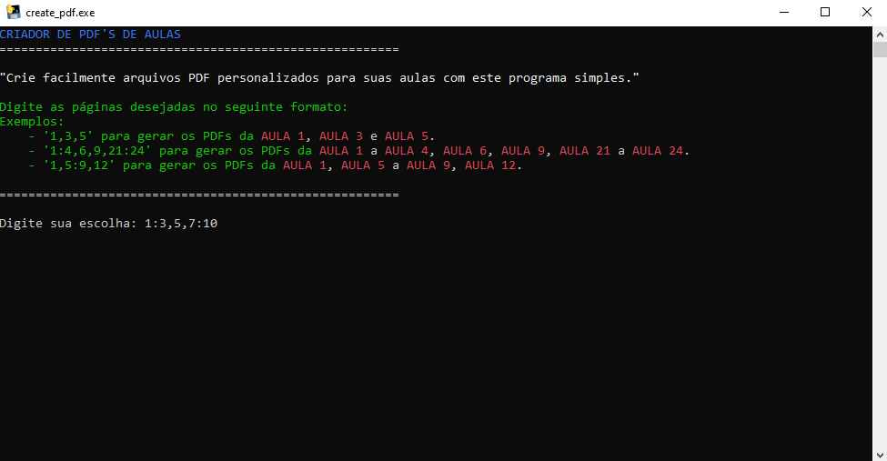
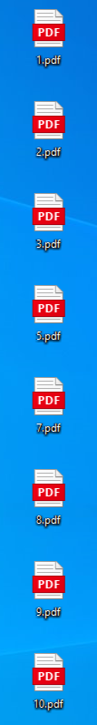
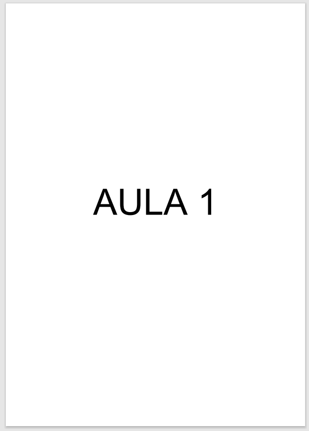

# ✨  Gerador de capas em arquivo PDF para Aulas

<p align="left">
    
    <!--  -->
    
</p>

Um programa simples em Python para criar facilmente capas personalizadas em arquivo PDF para suas aulas.

<br>
<div style="display: inline_block; text-align: center;">
    
    
    
</div>


##  :hammer_and_wrench: Instruções de Uso

1. **Execute o Programa:**
   - Certifique-se de ter o Python instalado em seu sistema.
   - Clone este repositório para o seu computador.

     ```bash
     git clone https://github.com/JoaoLagos/GeradorPDF_Aulas.git
     ```

   - Navegue até o diretório do projeto.

     ```bash
     cd GeradorPDF_Aulas
     ```

   - Execute o programa.

     ```bash
     python create_pdf.py
     ```

2. **Digite as Páginas Desejadas:**
   - O programa solicitará que você insira as páginas desejadas no formato especificado.

     ```
     Digite as páginas desejadas no seguinte formato:
     Exemplos:
     - '1,3,5' para gerar os PDFs da AULA 1, AULA 3 e AULA 5.
     - '1:4,6,9,21:24' para gerar os PDFs da AULA 1 a AULA 4, AULA 6, AULA 9, AULA 21 a AULA 24.
     - '1,5:9,12' para gerar os PDFs da AULA 1, AULA 5 a AULA 9, AULA 12.
     ```

3. **PDFs Gerados:**
   - Os PDFs serão gerados na sua Área de Trabalho (Desktop).

## :white_check_mark: Requisitos

- Python 3.x

## :handshake: Contribuições

Contribuições são bem-vindas! Sinta-se à vontade para abrir issues e pull requests.

## :memo: Licença

Este projeto está licenciado sob a [Licença MIT](LICENSE).
